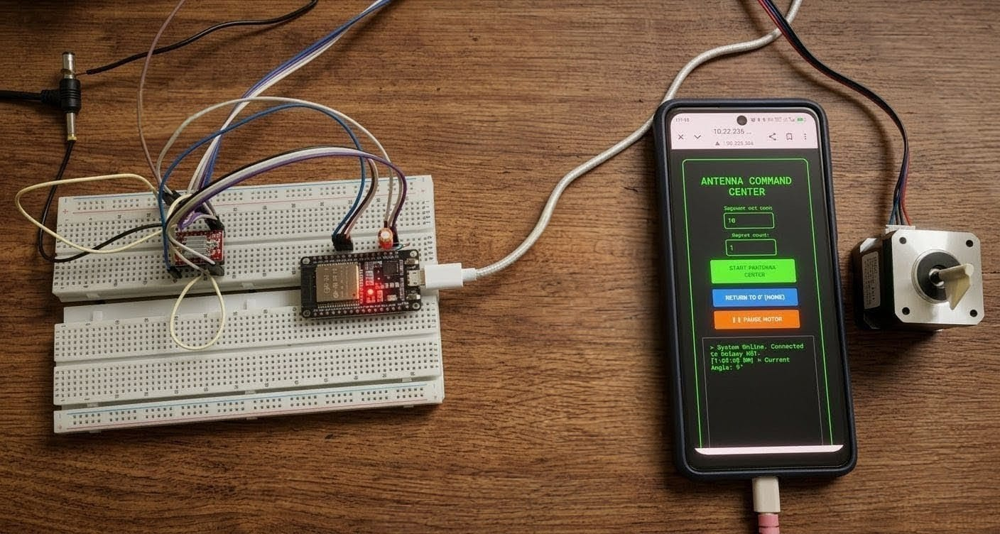
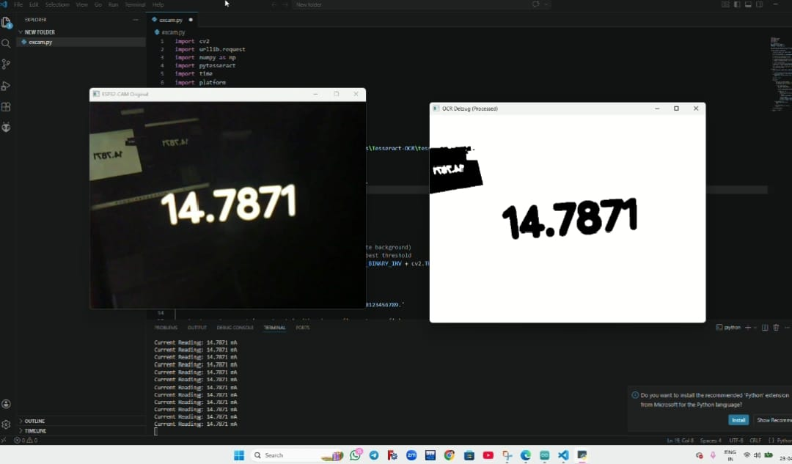

# 📡 Automated Antenna Radiation Pattern Measurement System

> **Design and Implementation of an Automated Antenna Radiation Pattern Measurement System using Embedded Control and Image Processing**

[](https://www.espressif.com/)
[](https://www.arduino.cc/)
[](https://opencv.org/)
[](https://www.aot.edu.in/)
[-purple)](/)

---

## 👥 Team

| Name | Roll No |
|------|---------|
| Shreya Paul | 125 |
| Shubhadip Das | 127 |
| Sutapa Mondal | 171 |
| Tanushree Das | 177 |
| Uttiyo Modak | 182 |

**Department:** Electronics and Communication Engineering (ECE-3)  
**Institution:** Academy of Technology, Hooghly – 712121, West Bengal, India  
**Mentor:** Tapas Tewary (TT Sir)  
**Affiliated University:** MAKAUT (Maulana Abul Kalam Azad University of Technology), West Bengal

---

## 📌 Overview

This project presents a **fully automated, embedded system** for measuring and plotting antenna radiation patterns — replacing the traditional, error-prone manual process with a seamless, integrated pipeline.

The system automatically:
1. **Rotates** the transmitting antenna in precise 10° increments via a stepper motor
2. **Captures** current meter readings non-invasively using an ESP32-CAM
3. **Extracts** numerical values from the camera feed using OCR (Optical Character Recognition)
4. **Calculates** relative radiated power in dB
5. **Plots** the radiation pattern physically on paper using a 2-axis CNC plotter

All controlled through a **Wi-Fi web interface** accessible from any smartphone or browser.

---

## 🖼️ Prototype

<table>
  <tr>
    <td align="center">
      
      <br/><b>Hardware Setup — ESP32, Motor & Web Command Center</b>
    </td>
    <td align="center">
      
      <br/><b>Live OCR Extraction — 14.7871 mA captured in real time</b>
    </td>
  </tr>
</table>

---

## 🎯 Objectives

- Automate antenna rotation in **10° steps** across a full 360° sweep (36 positions)
- Capture meter readings **non-invasively** using an ESP32-CAM (no electrical connection to meter)
- Extract numerical readings using **computer vision and OCR**
- Calculate **relative power in dB** using the formula:

$$Power(dB) = 20 \times \log\left(\frac{I_{reading}}{I_{max}}\right)$$

- Physically **plot the radiation pattern** on paper via a 2-axis CNC plotter
- Provide real-time **web-based control** (Start / Pause / Resume / Home)

---

## 🗂️ Project Structure

```
Final_Year_Project/
│
├── Motor/
│   └── motor.ino           # ESP32 firmware — motor control + web server UI
│
├── ESP32_Camera/
│   ├── camera.ino          # ESP32-CAM firmware — MJPEG stream server
│   └── extract.py          # Python OCR client — reads stream & extracts values
│
└── assets/
    ├── motor_with_webServer.jpeg       # Prototype hardware photo
    ├── image_extraction.jpeg           # OCR in action screenshot
    ├── Final_Year_Project_PPT.pdf      # Project presentation
    └── Final_Year_Project_Report-...pdf # Progress report (Phase 2)
```

---

## 🧱 System Architecture

```
                          ┌─────────────────────────────┐
                          │        User's Web UI        │
                          │  (Browser / Smartphone)     │
                          │  ▶ Start  ❚❚ Pause  ↺ Reset│
                          └────────────┬────────────────┘
                                       │ Wi-Fi (HTTP)
                          ┌────────────▼────────────────┐
                          │      Main Controller        │
                          │         ESP32               │
                          │  (Web Server + Motor Logic) │
                          └──────┬─────────────┬────────┘
                                 │             │
              ┌──────────────────▼──┐    ┌─────▼──────────────────┐
              │   NEMA 17 Stepper   │    │     ESP32-CAM System   │
              │   Motor + A4988     │    │  ESP32S CAM + CAM MB   │
              │   (Antenna Rotation)│    │  (Meter Image Capture) │
              └──────────────────┬──┘    └─────┬──────────────────┘
                                 │             │
              ┌──────────────────▼──┐    ┌─────▼──────────────────┐
              │  Transmitting       │    │  Python OCR Client     │
              │  Antenna (Rotating) │    │  (OpenCV + Tesseract)  │
              └─────────────────────┘    └─────┬──────────────────┘
                                               │ Extracted mA value
                          ┌────────────────────▼────────────────┐
                          │       2-Axis CNC Pen Plotter        │
                          │   2× 28BYJ-48 + ULN2003 + SG90      │
                          │   (Physical Radiation Pattern Plot) │
                          └─────────────────────────────────────┘
```

---

## 🔧 Hardware Components

### 1. Central Processing Unit
| Component | Specification |
|-----------|--------------|
| **ESP32** | 512MB RAM — Main controller, hosts web server |

### 2. Mechanical Rotation System
| Component | Role |
|-----------|------|
| **NEMA 17 Stepper Motor** | Rotates the transmitting antenna |
| **A4988 Motor Driver** | Controls antenna rotation with microstepping |

### 3. Computer Vision & Image Acquisition
| Component | Role |
|-----------|------|
| **ESP32S CAM** | Captures meter display images |
| **ESP32 CAM MB** | Connector board for ESP32-CAM |
| **Current Meter** | Measures received signal strength (mA) |

### 4. Physical Plotting System
| Component | Role |
|-----------|------|
| **28BYJ-48 Stepper (X-axis)** | Horizontal plotter movement |
| **28BYJ-48 Stepper (Y-axis)** | Vertical plotter movement |
| **ULN2003 Driver (×2)** | Motor control for both plotter axes |
| **SG90 Micro Servo** | Pen lift mechanism |
| **Linear Rails (×2)** | 300mm aluminium guide rails |
| **GT2 Timing Belts** | Precision belt-and-pulley drive |
| **Spring-loaded Pen Holder** | Consistent pen pressure on paper |

### 5. Power Supply
| Component | Specification |
|-----------|--------------|
| **12V 4A Power Adapter** | Main power; USB-C connector for ESP32 |

---

## 💻 Software Components

### `Motor/motor.ino` — ESP32 Web Server + Motor Controller

The ESP32 firmware hosts a **retro-terminal web UI** accessible over Wi-Fi. It controls the NEMA 17 stepper motor through the A4988 driver.

**Key features:**
- Full **web UI** (HTML/CSS/JS served from ESP32 flash) — no app install required
- `START ROTATION SEQUENCE` — configurable degrees-per-step and repeat count
- `PAUSE / RESUME` — mid-sequence pause with exact step resume (no position loss)
- `RETURN TO 0° (HOME)` — reverses to origin automatically
- Real-time **angle polling** every 500ms displayed in an on-screen terminal
- **30-second stabilization wait** at each position before data capture

**Motor API Endpoints:**

| Endpoint | Method | Description |
|----------|--------|-------------|
| `/` | GET | Serves the web control UI |
| `/run?deg=10&num=36` | GET | Start rotation (degrees per step, iterations) |
| `/pause` | GET | Pause motor mid-sequence |
| `/resume` | GET | Resume from exact paused position |
| `/goHome` | GET | Return to 0° home position |
| `/getAngle` | GET | Returns current angle (polled by UI) |

**Pin Configuration:**
```cpp
#define STEP_PIN    19   // A4988 STEP
#define DIR_PIN     18   // A4988 DIR
#define ENABLE_PIN  21   // A4988 ENABLE (active LOW)
```

---

### `ESP32_Camera/camera.ino` — ESP32-CAM MJPEG Stream Server

Configures the AI-Thinker ESP32-CAM module and streams a live **MJPEG video feed** over Wi-Fi on port 80. The Python OCR client connects to this stream.

**Key features:**
- MJPEG multipart stream at `http://<ESP32_IP>/`
- VGA resolution (`FRAMESIZE_VGA`) at JPEG quality 12
- Minimal latency, continuously serving frames in a `while(true)` loop
- Connects to same Wi-Fi hotspot as the motor controller

---

### `ESP32_Camera/extract.py` — Python OCR Client

Connects to the ESP32-CAM MJPEG stream and extracts the current meter reading in real time using OpenCV and Tesseract OCR.

**Processing pipeline:**
```
Raw MJPEG Frame
      │
      ▼
BGR → Grayscale
      │
      ▼
Gaussian Blur (5×5) — reduces sensor noise
      │
      ▼
Otsu Thresholding (BINARY_INV) — isolates digits
      │
      ▼
Tesseract OCR (--psm 7, whitelist: 0-9 and .)
      │
      ▼
Extracted value printed: "Current Reading: 14.7871 mA"
```

**Requirements:**
```bash
pip install opencv-python numpy pytesseract
```

Tesseract OCR must be installed separately:
- **Windows:** [Tesseract installer](https://github.com/UB-Mannheim/tesseract/wiki) → default path `C:\Program Files\Tesseract-OCR\tesseract.exe`
- **Linux/macOS:** `sudo apt install tesseract-ocr` / `brew install tesseract`

**Configuration in `extract.py`:**
```python
ESP32_IP = "10.22.235.166"   # ← Update with your ESP32-CAM's IP
pytesseract.pytesseract.tesseract_cmd = r'C:\Program Files\Tesseract-OCR\tesseract.exe'  # Windows path
```

---

## 🚀 Getting Started

### Prerequisites

- Arduino IDE with **ESP32 board support** installed
- Python 3.8+ with `opencv-python`, `numpy`, `pytesseract`
- Tesseract OCR installed on your system
- All hardware components assembled and wired
- A Wi-Fi hotspot (both ESP32 devices must connect to the same network)

---

### Step 1 — Configure Wi-Fi Credentials

Update the SSID and password in **both** `.ino` files:

```cpp
// In motor.ino AND camera.ino
const char* ssid     = "YourHotspotName";
const char* password = "YourPassword";
```

---

### Step 2 — Flash the Motor Controller

1. Open `Motor/motor.ino` in Arduino IDE
2. Select board: **ESP32 Dev Module**
3. Upload to your ESP32
4. Open Serial Monitor at **115200 baud** to find the assigned IP address
5. Navigate to `http://<ESP32_IP>/` in your browser to access the Control Center

---

### Step 3 — Flash the ESP32-CAM

1. Open `ESP32_Camera/camera.ino` in Arduino IDE
2. Select board: **AI Thinker ESP32-CAM**
3. Upload (use an FTDI programmer; GPIO0 to GND during flash)
4. Open Serial Monitor at **115200 baud** to find the stream IP
5. Update `ESP32_IP` in `extract.py` with this IP

---

### Step 4 — Run the OCR Extractor

```bash
cd ESP32_Camera
python extract.py
```

Two windows will appear:
- **ESP32-CAM Original** — live camera feed
- **OCR Debug (Processed)** — thresholded image used for OCR

Press **`q`** to quit.

---

### Step 5 — Run a Measurement

1. Open the Motor Controller web UI on your phone/browser
2. Set **Degrees per Move** = `10` and **Repeat Count** = `36` (for full 360° sweep)
3. Click **START ROTATION SEQUENCE**
4. The system will rotate, wait 30 seconds per position, and the OCR client captures readings
5. After all 36 positions, the plotter draws the radiation pattern on paper

---

## 📊 Data Flow & Calculation

At each of the 36 antenna positions (0° to 350°), the system records:

| Field | Description |
|-------|-------------|
| **Angle (°)** | Current antenna position |
| **Current Reading (mA)** | OCR-extracted value from meter |
| **Relative Power (dB)** | Calculated in ESP32 |

**Power Calculation:**
```
Power(dB) = 20 × log₁₀(I_reading / I_max)
```
Where `I_max` is the maximum current reading across all 36 positions (normalized reference).

---

## 🔌 Wiring Reference

### Motor Controller (ESP32 ↔ A4988 ↔ NEMA 17)
```
ESP32 GPIO 19  →  A4988 STEP
ESP32 GPIO 18  →  A4988 DIR
ESP32 GPIO 21  →  A4988 ENABLE  (pull LOW to enable)
12V Power      →  A4988 VMOT + GND
3.3V/5V        →  A4988 VDD + GND
A4988 1A/1B/2A/2B → NEMA 17 coil pairs
```

### ESP32-CAM (AI-Thinker Pinout)
The camera module uses the standard AI-Thinker pin mapping — connect via the ESP32 CAM MB breakout board. No additional wiring needed for the camera itself.

---

## ⚙️ System Workflow

```
START
  │
  ▼
Setup Web UI Server
  │
  ▼
User triggers via Web UI  ──────► PAUSE ──► RESUME ──┐
  │                                                    │
  ▼                                                    │
Rotate NEMA 17 by 10° (via A4988)  ◄──────────────────┘
  │
  ▼
Wait 30 seconds (signal stabilization)
  │
  ▼
ESP32-CAM captures meter image
  │
  ▼
Python OCR extracts current value (mA)
  │
  ▼
ESP32 stores (Angle, Current, dB Power)
  │
  ▼
Repeat for all 36 positions (360°)
  │
  ▼
Activate 2-axis plotter (28BYJ-48 × 2 + ULN2003)
  │
  ▼
Draw Angle vs. dB Power graph on paper
  │
  ▼
END
```

---

## 📐 Feasibility Analysis

| Dimension | Assessment |
|-----------|-----------|
| **Technical** | NEMA 17 provides precise angular control; ESP32-CAM enables non-contact data capture; CNC plotter draws physical graphs |
| **Operational** | Fully automated via single web UI; minimal human supervision; no complex RF interfacing required |
| **Economic** | Low-cost off-the-shelf components; eliminates expensive dedicated antenna measurement instruments |

---

## 🔍 Gap Addressed

| Gap in Existing Systems | Our Solution |
|------------------------|--------------|
| Automates only rotation OR measurement, not both | Full end-to-end automation in a single integrated system |
| Requires wired electrical connection to meters | Non-invasive OCR-based camera reading — zero electrical interference |
| Relies on PC-based processing | Self-contained embedded operation on ESP32 |
| Graphs are only digitally plotted | Physical paper graph drawn by CNC plotter |
| Human intervention still required | Fully hands-free after initial start command |

---

## 📚 References

1. R. C. Johnson — *Antenna Engineering Handbook*
2. Constantine A. Balanis — *Antenna Theory: Analysis and Design*
3. S. C. Orfanidis — *Electromagnetic Waves and Antennas*
4. Jacob Fraden — *Handbook of Modern Sensors*
5. Zhang et al. — Vision-based instrument reading via OCR: [IEEE Xplore](https://ieeexplore.ieee.org/document/8461184)
6. Y. Yalçın, S. Kurtulan — Motor-controlled antenna positioning systems: [IEEE DOI](https://doi.org/10.1109/MAP.2009.5162072)

---

## 🔮 Future Scope

- **Polar graph plotting** — Generate standard polar radiation pattern diagrams
- **AI-based OCR improvement** — Replace Tesseract with a fine-tuned CNN for higher accuracy on seven-segment displays
- **Data export** — CSV/JSON logging of all measurement triplets (Angle, mA, dB)
- **Web-based graph visualization** — Real-time polar plot rendered in the web UI

---

## 📄 License

This project was developed as a Final Year academic project at **Academy of Technology, West Bengal** under **MAKAUT**. All code and documentation are for educational purposes.

---

<div align="center">

Made with ❤️ by Team ECE-3 (Batch 2027) | Academy of Technology

</div>